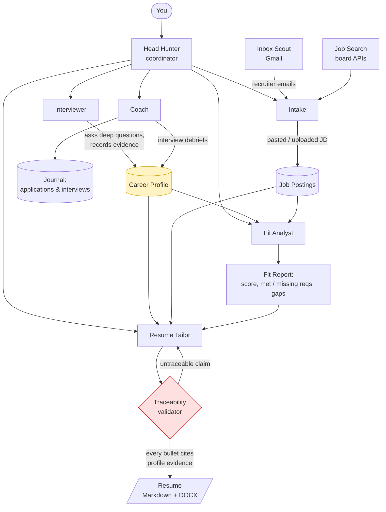

# Head Hunter Agent

An AI agent that helps you land a job: it learns your career in depth, evaluates job postings against what you've actually done, writes tailored resumes that never invent anything, watches your inbox for recruiters, and coaches you between interviews.

Built on [Google ADK](https://google.github.io/adk-docs/) with Gemini on Google Cloud.

## How it works

Everything revolves around one thing: your **Career Profile**. It's a structured, evidence-backed record of your roles, accomplishments, skills, and goals. Every agent either adds to it or reads from it. If the profile is rich, everything downstream is good; if it's thin, nothing else can be.



### The agents

| Agent | What it does |
|---|---|
| **Head Hunter** | Front door. Figures out what you need and hands off to the right specialist. |
| **Interviewer** | Interrogates your career like a great recruiter would: what you built, for whom, what changed because of it, what you'd do differently. Records everything as evidence in the profile. Notices its own gaps and comes back to them. |
| **Intake** | Takes a job description (pasted, uploaded, forwarded from email, or found by search) and normalizes it into a structured posting. |
| **Fit Analyst** | Compares a posting to your profile. Gives a score, lists requirements you meet with the evidence, requirements you don't, and separates stretch gaps from hard blockers. |
| **Resume Tailor** | Writes an ATS-friendly resume for one specific job. Every bullet is tied to a profile entry. A separate validator rejects anything it can't trace, and the DOCX cannot be produced until it passes. |
| **Inbox Scout** | Reads your Gmail, spots recruiter outreach, pulls out role/company/comp, and feeds it to Intake. |
| **Coach** | Logs applications and interviews, asks reflective questions after each one, and points out patterns over time. |

### Rules that don't bend

1. **No invented experience.** The resume can only say things the profile says. Not "similar," not "implied." If it's not there, the Interviewer asks you for it first.
2. **The profile is the source of truth.** Agents don't keep private notes about you.
3. **You can read everything.** Profile, jobs, reports, and journal are all plain data you can inspect and edit.

## Phases

| Phase | Goal | Status |
|---|---|---|
| **0 – Scaffold** | Repo, docs, ADK skeleton, schemas, hello-world agent, both collaborators running `adk web` | ✅ |
| **1 – Proof of concept** | Interviewer → Profile → paste a JD → Fit Report. The loop we iterate on. | ✅ |
| **2 – Resume** | Resume Tailor, traceability validator, Markdown + DOCX output, eval cases | ✅ |
| **3 – Connectors & deploy** | Gmail Inbox Scout, one job-board API, Firestore, Cloud Run | |
| **4 – Coach** | Application tracker, interview debriefs, pattern reflection | |
| **Later** | Auth and multi-user, billing, web UI | |

## Running it

Fastest path is Google Cloud Shell (nothing to install, already authenticated):

```bash
git clone https://github.com/tdoolittle3/head-hunter-agent.git
cd head-hunter-agent
cp .env.example .env        # fill in GOOGLE_CLOUD_PROJECT
pip install -r requirements.txt
adk web head_hunter
```

Then open Web Preview on port 8000 and talk to the Head Hunter.

### Trying the Phase 2 loop

1. Say hello. Ask it to interview you.
2. Spend ten minutes on your career. It will walk backwards through your roles
   and push for numbers. Answer as you would a recruiter.
3. Paste a job description straight into the chat.
4. Ask for a fit analysis.
5. Ask for a resume for that job.

Everything lands as readable JSON under `data/` -- open the files and check
them. `data/profile.json` should contain your actual words under `evidence`;
if it contains anything you did not say, that is a bug worth reporting.

The resume lands three times over: `data/resumes/<job_id>.json` is the record
with its validation result, `.md` is the canonical text, and `.docx` is the
file you would actually send. Markdown is the source of truth -- edit it and
re-render and your edit survives.

**The interesting thing to try is breaking it.** Ask for a bullet the profile
does not support: "say I led a team of twelve", or "add that I know Kubernetes".
The Tailor will come back and tell you it cannot, because `validate_resume()`
is a plain Python function comparing each bullet against the evidence it cites,
and no amount of asking changes its answer. If it ever does write something you
did not tell it, that is the bug worth reporting above all others.

Locally, do the same after `gcloud auth application-default login`.

Point `adk web` at `head_hunter` rather than at the repo root: ADK searches for
agents recursively, so from the root it lists every agent folder separately and
you have to guess which one is the front door.

If the chat window returns a 404 about the model, your Google Cloud project
does not serve the default. Uncomment `HH_MODEL` in `.env`, set it to a model
your project does have, and restart — no code change needed.

The default is `gemini-2.5-flash` rather than ADK's own `gemini-3.5-flash`,
which returned 404 in every project tried. Vertex only serves the models a
given project and region are entitled to, and that varies.

### Common commands

`make help` lists these. On Windows, where `make` is usually absent, run the
right-hand side directly:

| Command | What it runs |
|---|---|
| `make dev` | `adk web head_hunter` — the chat UI |
| `make agents` | `adk web head_hunter/agents` — every agent listed separately, for testing one alone |
| `make test` | `pytest` |
| `make lint` | `ruff check .` and `ruff format --check .` |
| `make format` | `ruff format .` and `ruff check --fix .` |
| `make check` | lint then test; must pass before opening a PR |
| `make eval` | run the ADK eval set (needs `pip install "google-adk[eval]"`) |
| `make deploy-test` | deploy to the test Cloud Run service |
| `make proxy-test` | open an authenticated tunnel to it |

## Deploying

> **Read this first.** The profile is stored as JSON on local disk. Cloud Run
> filesystems are in-memory, per-instance, and wiped on restart, so a deployed
> Head Hunter **forgets everything** — the profile, and the conversation. That
> is what Firestore in Phase 3 fixes. Until then, treat a deploy as a smoke test
> that the container builds and the agent answers, **not** as somewhere to keep
> a real career profile.

`adk deploy` generates the Dockerfile; there is nothing to write. It copies only
the `head_hunter/` folder, which is why `head_hunter/requirements.txt` exists
separately from the one at the repo root — a test keeps the two in sync.

Once per project:

```bash
make enable-apis PROJECT=your-project-id
```

Then deploy:

```bash
make deploy-test TEST_PROJECT=your-test-project-id
```

The service is deployed **private** (`--no-allow-unauthenticated`). Reach it
through an authenticated tunnel rather than opening it to the internet:

```bash
make proxy-test TEST_PROJECT=your-test-project-id
```

That serves it on `localhost:8080`. Production is the same shape:

```bash
make deploy-prod PROD_PROJECT=your-prod-project-id
```

Use two separate Google Cloud projects for test and production. Vertex quota,
IAM, and billing are all per-project, so a test run that burns through quota
should not be able to take down anything you depend on.

If your project does not serve the default model, pass it through:
`make deploy-test TEST_PROJECT=... MODEL=gemini-2.5-pro`.

### What is still missing before this is really "production"

1. **Firestore** (Phase 3) — without it the profile does not survive a restart.
2. **A persistent session service** — `--session_service_uri` is unset, so chat
   history is in-memory too.
3. **Auth** — `HH_USER_ID` is fixed to `local`, so everyone who reaches the
   service shares one profile. Keep it private until multi-user lands.

## Project layout

```
head_hunter/
  agent.py       entry point adk web loads; wraps the coordinator in an App
  agents/        one folder per agent: agent.py + prompt.md
                 head_hunter (coordinator), interviewer, intake, fit_analyst,
                 resume_tailor
  requirements.txt  container-only deps (adk deploy copies just this folder)
  schemas/       Pydantic models: Profile, JobPosting, FitReport, Resume, JournalEntry
  storage/       repository interface + JSON (Phase 1) and Firestore (Phase 3) backends
  tools/         functions agents can call, grouped per agent
  scoring.py     deterministic fit score -- never the model's opinion
  jd_text.py     deterministic job-description clean-up
  resume_validation.py  validate_resume() -- the traceability check, plain Python
  resume_render.py      Resume -> Markdown -> DOCX
  evals/         ADK eval sets + fixture profile, for hallucination checks
data/            local JSON store (gitignored)
  profile.json     your career profile
  jobs/            one file per posting
  fit_reports/     one file per analysis
  resumes/         one .json record, .md and .docx per posting
docs/            deeper design notes, including PLAN.md
tests/           pytest suite
AGENTS.md        conventions for AI coding agents and humans alike
CLAUDE.md        imports AGENTS.md for Claude Code
```

## For AI agents reading this

This README plus `AGENTS.md` is the intended context. The Mermaid diagram above is the authoritative logic flow; if code and diagram disagree, fix one and say which.
